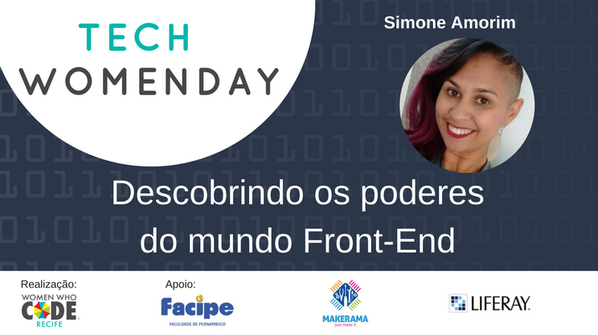

# Tech WomenDay - Workshop Descobrindo os poderes do mundo Front-end.

O Tech WomenDay foi um evento onde juntas celebrarmos o mês das mulheres. Elaborei com muito carinho um passo a passo, de tudo que foi aplicado no worshop de **Desenvolvimento Web**, e você pode utilizar esse conteúdo pra colocar a mão na massa e/ou repassar pra alguém que ainda está iniciando na área!!!

### [Acesse aqui o material](./docs/starting.md)

## Se você quiser abrir na sua máquina a aplicação que criamos, siga os passos abaixo:

**1 -** Faça uma cópia do projeto:

```sh
$ git clone https://github.com/womenwhocoderecife/my-clock.git
```

**2 -** Abra a plicação no seu navegador:

> Abra o arquivo index.html em qualquer navegador web.

## Versionamento

Para manter uma melhor organização das alterações do projeto, seguiremos o padrão de [Versionamento Semântico 2.0.0](http://semver.org/).

## Contribuição

Encontre em nossas [issues](https://github.com/womenwhocoderecife/my-clock/issues/) as próximas etapas do projeto.  
Quer contribuir conosco? [Siga essas recomendações](CONTRIBUTING.md).

## Licença

[Licença MIT](LICENSE.md) © [Simone Amorim](https://simoneas02.github.io)
